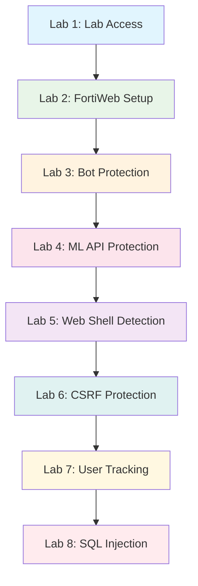

# FortiWeb Web Application & API Protection Workshop

Welcome to the comprehensive FortiWeb hands-on workshop. Learn to configure and deploy FortiWeb's unified Web Application and API Protection (WAAP) platform to secure business-critical applications.

!!! info "Workshop Overview"
    This workshop provides hands-on experience with FortiWeb's advanced security features through practical labs using vulnerable applications like DVWA and JuiceShop.

## What is FortiWeb?

-   :shield:{ .lg .middle } **Web Application Firewall**

    ---

    Comprehensive protection against OWASP Top 10 threats, zero-day attacks, and advanced persistent threats targeting web applications.

-   :robot:{ .lg .middle } **Advanced Bot Protection**

    ---

    AI-powered bot detection and mitigation to defend against automated attacks, credential stuffing, and malicious crawlers.

-   :api:{ .lg .middle } **API Security**

    ---

    Complete API protection including schema validation, rate limiting, and advanced threat detection for REST and GraphQL APIs.

-   :cloud:{ .lg .middle } **Cloud-Native Ready**

    ---

    Deploy across AWS, Azure, Google Cloud, and Oracle with seamless integration into cloud security architectures.

## Key Features

### :material-security: Core Security Capabilities

!!! example "Protection Layers"
    === "Application Layer"
        - **SQL Injection Protection**: Advanced pattern matching and machine learning detection
        - **Cross-Site Scripting (XSS)**: Real-time script analysis and blocking
        - **CSRF Protection**: Token validation and origin verification
        - **File Upload Security**: Content inspection and malware detection

    === "API Protection"
        - **Schema Validation**: OpenAPI/Swagger specification enforcement
        - **Rate Limiting**: Granular control over API consumption
        - **OAuth/JWT Validation**: Token-based authentication verification
        - **Data Loss Prevention**: Sensitive data scanning and blocking

    === "Advanced Features"
        - **Machine Learning**: Behavioral analysis and anomaly detection
        - **Web Shell Detection**: Advanced payload analysis
        - **User Tracking**: Session management and user behavior analytics
        - **Load Balancing**: High availability with health monitoring

### :material-cog: Deployment Options

-   **Physical Appliances**

    ---

    High-performance hardware appliances for on-premises deployments with dedicated processing power.

-   **Virtual Machines**

    ---

    Software-based deployment for virtualized environments with flexible scaling options.

-   **Cloud Instances**

    ---

    Native cloud deployment across major cloud service providers with auto-scaling capabilities.

-   **Container Deployments**

    ---

    Kubernetes-native deployment for modern containerized application architectures.

## Workshop Learning Path

!!! tip "Progressive Learning"
    Each lab builds upon the previous configuration, providing a comprehensive understanding of FortiWeb deployment and management.

### :material-format-list-numbered: Lab Modules

| Lab | Topic | Duration | Difficulty |
|-----|-------|----------|------------|
| 1 | Lab Access & Environment Setup | 15 min | :material-circle-outline: Beginner |
| 2 | FortiWeb Configuration Basics | 30 min | :material-circle-outline: Beginner |
| 3 | Bot Protection Implementation | 45 min | :material-circle-half-full: Intermediate |
| 4 | Machine Learning API Protection | 45 min | :material-circle-half-full: Intermediate |
| 5 | Web Shell Detection & Prevention | 30 min | :material-circle-half-full: Intermediate |
| 6 | CSRF Protection Mechanisms | 30 min | :material-circle-half-full: Intermediate |
| 7 | User Tracking & Analytics | 30 min | :material-circle-half-full: Intermediate |
| 8 | SQL Injection Prevention | 45 min | :material-circle: Advanced |

## Use Cases & Benefits

### :material-target: Primary Use Cases

!!! success "Enterprise Applications"
    - **E-commerce Platforms**: Protect customer data and transaction processing
    - **Financial Services**: Secure banking applications and payment systems
    - **Healthcare Systems**: Safeguard patient data and HIPAA compliance
    - **Government Portals**: Protect citizen services and sensitive information

!!! success "API Ecosystems"
    - **Microservices Architecture**: Secure service-to-service communication
    - **Third-party Integrations**: Control external API access and usage
    - **Mobile Application Backends**: Protect mobile app API endpoints
    - **IoT Device Communication**: Secure device-to-cloud connectivity

### :material-check-all: Key Benefits

-   :material-clock-fast:{ .lg .middle } **Rapid Deployment**

    ---

    Quick setup with pre-configured security policies and automated threat intelligence updates.

-   :material-chart-line:{ .lg .middle } **Performance Optimization**

    ---

    Built-in load balancing and acceleration features to improve application performance.

-   :material-shield-check:{ .lg .middle } **Compliance Ready**

    ---

    Built-in compliance templates for PCI DSS, GDPR, HIPAA, and other regulatory requirements.

-   :material-integration:{ .lg .middle } **Security Fabric Integration**

    ---

    Seamless integration with Fortinet Security Fabric for unified threat intelligence and response.

## Workshop Environment

!!! warning "Prerequisites"
    - Use an incognito/private browser window to prevent charges to personal accounts
    - Basic understanding of web application security concepts
    - Familiarity with network configuration principles

!!! info "Lab Environment Details"
    - **Vulnerable Applications**: DVWA (Damn Vulnerable Web Application) and OWASP Juice Shop
    - **Platform**: Google Cloud Platform with Qwiklabs integration
    - **Access Method**: Temporary credentials provided during workshop
    - **Duration**: Approximately 4-5 hours for complete workshop

## Getting Started

Ready to begin your FortiWeb journey? Start with Lab 1 to access your workshop environment and configure your first FortiWeb deployment.

[Get Started with Lab 1 :material-arrow-right:](01-lab-access.md){ .md-button .md-button--primary }
